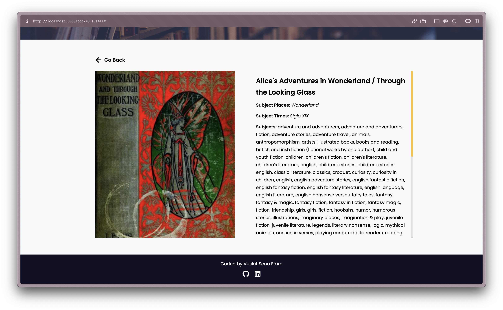

# GoogleSearchBook

## Installation

1. Clone the repository
2. `yarn` command to install dependencies
3. `yarn start` command to run the application

## Assignment Requirements

https://academy.patika.dev/courses/frontend-web-development-projeleri/kitap_arama_uygulamas%C4%B1

## Result

